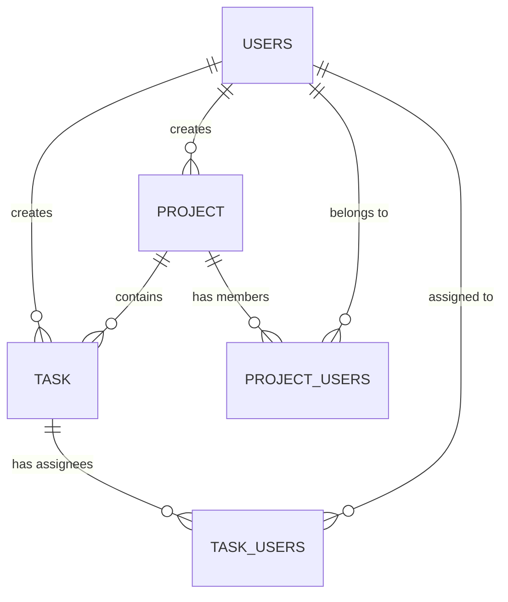

# WorkLog - Project & Task Management API

WorkLog is a robust, enterprise-grade Spring Boot backend REST API designed for managing users, projects, and tasks. It features secure JWT-based authentication, role-based access control (RBAC), and comprehensive task progress tracking.

## 🚀 Tech Stack

*   **Java 21**
*   **Spring Boot 3.4.x** (Web, Data JPA, Security)
*   **PostgreSQL** (Relational Database)
*   **JWT (JSON Web Tokens)** (Stateless Authentication)
*   **MapStruct** (Object Mapping)
*   **Lombok** (Boilerplate Reduction)
*   **JUnit 5 & Mockito** (Unit & Integration Testing)
*   **Docker** (Containerization for Deployment)

## 🏗️ Architecture & Database Design

The project strictly follows a 3-tier architecture: `Controller -> Service -> Repository`. 
It avoids the pitfalls of generic Many-To-Many relationships by using explicit Join Entities (`ProjectUserEntity`, `TaskUserEntity`), allowing for future scalability (e.g., assigning specific roles or timestamps to task assignments).

### Entity Relationship Diagram


## 🔐 Security & Roles

The API is secured using Spring Security and a custom JWT filter.
*   `ROLE_USER`: Can manage their own profile, create projects/tasks, and view their dashboard statistics.
*   `ROLE_ADMIN`: Has unrestricted access. Can view, update, and delete any user, project, or task in the system.

## ⚙️ Setup & Installation

### Prerequisites
*   Java 21 installed.
*   PostgreSQL running locally or remotely.
*   Maven installed (or use the included `mvnw` wrapper).

### 1. Database Setup
Create a PostgreSQL database named `worklog`:
```sql
CREATE DATABASE worklog;
```

### 2. Environment Variables
Create a `.env` file in the root directory (or configure your IDE to set these variables) to prevent hardcoding credentials:
```properties
DB_URL=jdbc:postgresql://localhost:5432/worklog
DB_USERNAME=postgres
DB_PASSWORD=your_password
SERVER_PORT=8081
```
*Note: In `application.properties`, the JWT secret is already set for development. For production, pass a secure `JWT_SECRET` variable.*

### 3. Run the Application
```bash
./mvnw spring-boot:run
```
The API will start on `http://localhost:8081`.

## 📡 API Endpoints

*All endpoints under `/api/*` (except auth) require an `Authorization: Bearer <token>` header.*

### Authentication
*   `POST /api/auth/register` - Register a new user.
*   `POST /api/auth/login` - Authenticate and receive a JWT token.

### Users
*   `GET /api/users/me` - Get current logged-in user profile.
*   `PUT /api/users/me` - Update current user profile.
*   `GET /api/users` - Get all users (Admin only).
*   `PUT /api/users/{id}` - Update any user (Admin only).
*   `DELETE /api/users/{id}` - Delete user (Admin only).

### Projects
*   `POST /api/projects` - Create a new project (Creator is assigned via token).
*   `GET /api/projects/my-projects` - Get all projects the user created or is assigned to.
*   `GET /api/projects/recent` - Get 5 most recent projects.
*   `GET /api/projects/{id}` - Get project by ID.
*   `PUT /api/projects/{id}` - Update project and its member list.
*   `DELETE /api/projects/{id}` - Delete project (Only if all tasks are completed).

### Tasks
*   `POST /api/tasks` - Create a task within a project.
*   `GET /api/tasks/my-tasks` - Get tasks created by or assigned to the user.
*   `GET /api/tasks/my-tasks/due-today` - Get user's tasks due today.
*   `GET /api/tasks/stats` - Get dashboard stats (Total, Completed, Incomplete, Overdue).
*   `PUT /api/tasks/{id}` - Update a task.
*   `DELETE /api/tasks/{id}` - Delete a task.

## 🧪 Testing

The project includes unit tests for the Service layer using JUnit 5 and Mockito.

To run the tests:
```bash
./mvnw test
```

## 🐳 Deployment (Docker & Render)

The project includes a multi-stage `Dockerfile` optimized for cloud platforms like Render. It automatically binds to the dynamic `$PORT` provided by the host environment.

To build the image locally:
```bash
docker build -t worklog-api .
```

To run the container:
```bash
docker run -p 8080:8080 -e DB_URL=... -e DB_USERNAME=... -e DB_PASSWORD=... worklog-api
```
